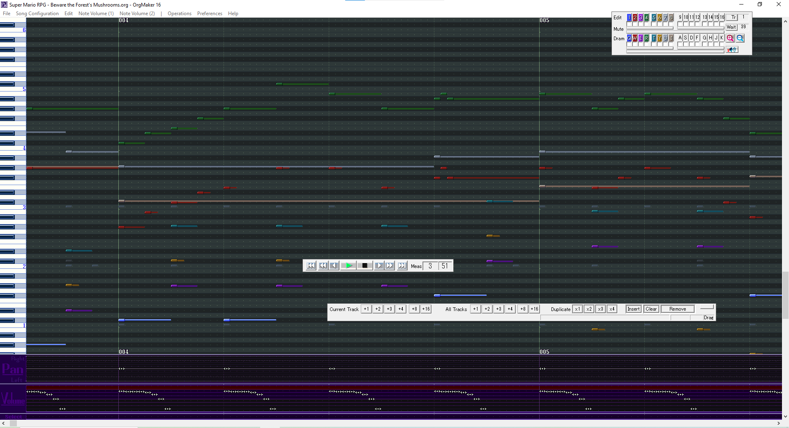

**The latest and greatest in 32 Organya Track technology!**

**Fork of a Fork of a music sequencer for retro video games**

This does not use a MIDI device.  

## History

The original program was created by [Studio Pixel](http://studiopixel.sakura.ne.jp/) in 1999, and was used in [Cave Story](https://www.cavestory.org/).

It was then updated multiple times by [Rxo Inverse](https://www5b.biglobe.ne.jp/~kiss-me/aji/index.html) throughout 2003-2014, and was used in [STARGAZER](https://www5b.biglobe.ne.jp/~kiss-me/aji/stargazerj.html)

As of this being written, [Strultz](https://strultz.github.io/) is working on [OrgMaker 3](https://github.com/Strultz/orgmaker-3/tree/main), which aims to add more features to OrgMaker.

## Features

16 Melody Tracks with 100 Waveforms to select from, along with 16 Dram Tracks with 43 Dram Samples to choose from.

Compatable with previous versions of OrgMaker.

Exporting ORG-16 File as a WAV file.

(Soon)Cave Story Engine 2 support!!

## Download

Check the Releases for the latest version: 

## Compiling

You'll need Visual Studio(it doesn't matter the version) with the `Desktop development with C++` workload. You should also select something along the lines of  `C++ v143 build tools`. After installing, open `source/Org3.sln` and build the project.

## License

BSD 3-Clause License

Copyright (c) 2025-2026 Bi_N

Copyright (c) 2023-2025 Strultz

Copyright (c) 2004-2018 Rxo Inverse

Copyright (c) 1999-2004 Studio Pixel

All rights reserved.

Redistribution and use in source and binary forms, with or without
modification, are permitted provided that the following conditions are met:

* Redistributions of source code must retain the above copyright notice, this
  list of conditions and the following disclaimer.

* Redistributions in binary form must reproduce the above copyright notice,
  this list of conditions and the following disclaimer in the documentation
  and/or other materials provided with the distribution.

* Neither the name of the copyright holder nor the names of its
  contributors may be used to endorse or promote products derived from
  this software without specific prior written permission.

THIS SOFTWARE IS PROVIDED BY THE COPYRIGHT HOLDERS AND CONTRIBUTORS "AS IS"
AND ANY EXPRESS OR IMPLIED WARRANTIES, INCLUDING, BUT NOT LIMITED TO, THE
IMPLIED WARRANTIES OF MERCHANTABILITY AND FITNESS FOR A PARTICULAR PURPOSE ARE
DISCLAIMED. IN NO EVENT SHALL THE COPYRIGHT HOLDER OR CONTRIBUTORS BE LIABLE
FOR ANY DIRECT, INDIRECT, INCIDENTAL, SPECIAL, EXEMPLARY, OR CONSEQUENTIAL
DAMAGES (INCLUDING, BUT NOT LIMITED TO, PROCUREMENT OF SUBSTITUTE GOODS OR
SERVICES; LOSS OF USE, DATA, OR PROFITS; OR BUSINESS INTERRUPTION) HOWEVER
CAUSED AND ON ANY THEORY OF LIABILITY, WHETHER IN CONTRACT, STRICT LIABILITY,
OR TORT (INCLUDING NEGLIGENCE OR OTHERWISE) ARISING IN ANY WAY OUT OF THE USE
OF THIS SOFTWARE, EVEN IF ADVISED OF THE POSSIBILITY OF SUCH DAMAGE.

